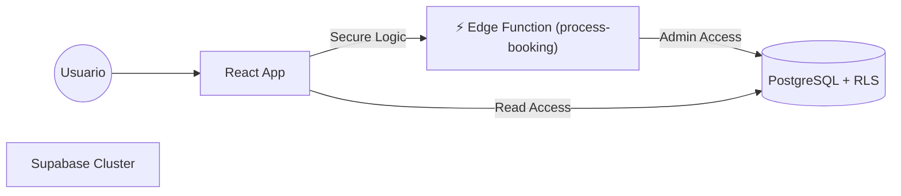

# 💈 Chronos Barber System

[](https://supabase.com)
[](https://github.com/jordelmir/Barberias)

Chronos Barber System es una plataforma de gestión operativa de alto rendimiento diseñada para barberías modernas, con arquitectura **Multi-Tenant** y **Edge Functions**.

---

## 🏗️ Arquitectura del Sistema

El sistema utiliza una arquitectura **SaaS Multi-Tenant** sobre Supabase:



### ⚡ Edge Functions (Server-Side Logic)
Para garantizar la integridad crítica de los datos, ciertas operaciones se ejecutan en el servidor (Deno):
- **`process-booking`**: Valida solapamientos de horario y reglas de negocio antes de confirmar una reserva. Evita "double-booking" malicioso.

### 🔐 Seguridad y Aislamiento (RLS)
Cada "Administrador" es una empresa (Tenant) independiente. La base de datos utiliza **Row Level Security (RLS)**.
- **100 Admins Pre-cargados**: Migración automática (`20240110_init_multitenant.sql`).

---

## 🚀 Setup Local

Sigue estos pasos para levantar el entorno de desarrollo y la base de datos localmente:

### 1. Iniciar Supabase
```bash
npx supabase start
```
Esto levanta:
- Base de Datos (Postgres)
- Auth Server
- **Edge Runtime** (para funciones)
- Studio (Dashboard en `http://localhost:54323`)

### 2. Probar Edge Function
La función `process-booking` estará disponible en:
`http://localhost:54321/functions/v1/process-booking`

### 3. Instalar dependencias y correr App
```bash
npm install
npm run dev
```

---

## ☁️ Despliegue a Producción

1. **Crear Proyecto en Nube**: Ve a [Supabase.com](https://supabase.com).
2. **Linkear**: `npx supabase link --project-ref tu-project-id`
3. **Subir BD**: `npx supabase db push`
4. **Desplegar Funciones**: 
   ```bash
   npx supabase functions deploy process-booking
   ```
5. **Configurar Secretos**:
   ```bash
   npx supabase secrets set --env-file .env
   ```

---

Developed with ❤️ by **Antigravity AI Architect**.
